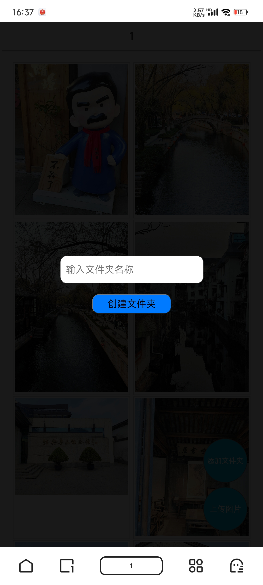

# local-image-manager

## 简介

local-image-manager 是一个用于本地局域网电脑-手机互传图片的 Node.js 应用程序。它可以帮助您方便地浏览、上传和预览电脑上的图片。

## 运行环境安装与指令

在运行本项目之前，请确保您的系统已安装以下环境：

1. Node.js: 请从 [Node.js 官网](https://nodejs.org/) 下载并安装最新版本。
2. npm: 通常在安装 Node.js 时会自动安装 npm。

安装完运行环境后，您可以按照以下步骤操作：

1. 克隆本项目到本地：

```bash
git clone https://github.com/frankfurtlin/local-image-manager.git
```

2. 进入项目目录：
```bash
cd local-image-manager
```

3. 安装项目依赖：
```bash
npm install
```

4. 启动项目：
```bash
npm start
```

5. 访问

手机访问控制台打印的 ip:port

## 未来改进点
- [ ] 添加用户登录功能，防止局域网其他用户偷看
- [ ] 优化图片预览性能，懒加载减轻带宽压力
- [ ] 支持批量下载图片
- [ ] 实现智能排序功能，尽量保证每排照片比例一致
- [ ] 实现拖拽排序功能（高级）

## 运行截图


<details>
  <summary>1. 首页</summary>
  
</details>

<details>
  <summary>2. 预览图片</summary>
  
</details>

<details>
  <summary>3. 新建文件夹及成功</summary>
  
  
</details>

<details>
  <summary>4. 上传图片进度条及成功</summary>
  
  
</details>

---

如果您有任何问题或建议，请随时在 GitHub 上提 issue。感谢您的使用！

Made with ❤️ by frankfurtlin